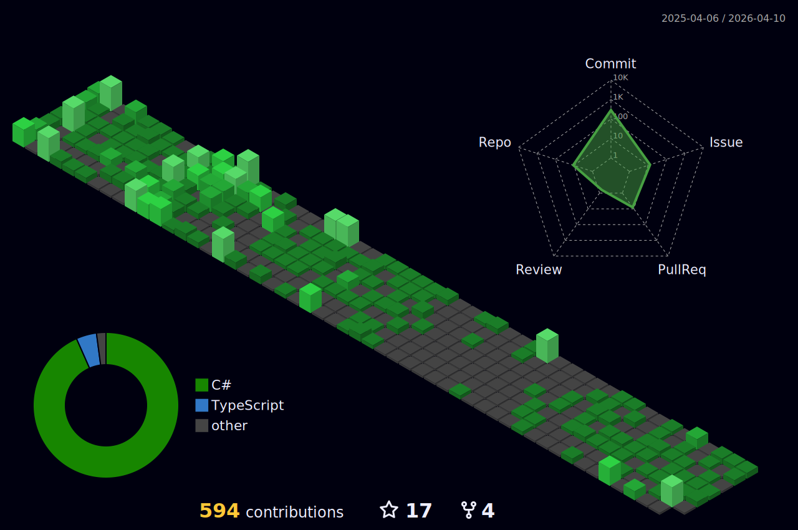

<h1 align="center">Hello 👋, I'm Murilo Nascimento</h1>
<h3 align="center">Full Stack Developer</h3>

<table align="right">
  <tr>
    <td height="43px">
      <b>
        <a href="README.md">Portuguese 🇧🇷</a>
      </b>
    </td>
  </tr>
  <tr>
    <td height="43px">
      <a href="README-en.md">English 🇺🇸</a>
    </td>
  </tr>
</table>

   

- 🧠 Working with **Zeedhi**, **JavaScript**, **PHP**, and **SQL**

- 🌇 Currently working at **Teknisa**

- 🌱 Currently learning **Slim Framework**

- 📚 Currently reading **Data Structures and Algorithms with JavaScript**

- 🎨 Created my own theme for VSCode, available at **[Northeirn](https://github.com/murilonicemento/northeirn-theme)**

- 👨‍💻 Some of my main projects are available on **[My Portfólio](https://my-portfolio-chi-nine.vercel.app/projects)**

  

## Activities

## Languages and Tools

## Connect with Me

