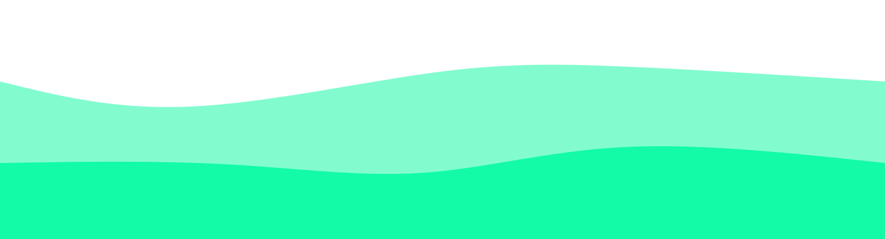

<h1 align="center">Hi 👋, I'm Murilo Nascimento</h1>
<h3 align="center">A Passionate Front-end Developer From Brazil</h3>

<table align="right">
  <tr>
    <td height="43px">
        <a href="README.md">Português 🇧🇷</a>
    </td>
  </tr>
  <tr>
    <td height="43px">
      <b>
       <a href="README-en.md">English 🇺🇸</a>
      </b>
    </td>
  </tr>
</table>

  

- 🌱 I’m currently learning <strong style="color: #61DAFB;">Jest</strong>

- 🔭 I’m currently working on <strong style="color: #61DAFB;">[upload.ai](https://github.com/murilonicemento/upload-ai)</strong>

- 💬 Ask me about <strong style="color: #61DAFB;">anything you want</strong>

- 👨‍💻 Some of my projects are available at <strong style="color: #61DAFB;">[My Portfolio](https://my-portfolio-chi-nine.vercel.app/projects)</strong>

- 📝 I regularly write articles on <strong style="color: #61DAFB;">[Dev To](https://dev.to/murilonicemento)</strong>

- 📫 How to reach me <strong style="color: #61DAFB;">murilo_nascimento22@outlook.com</strong>

  

## Activities

  

  

  
  
   
   
  

    
  

## Languages and Tools

## Connect with me

<!--  -->
