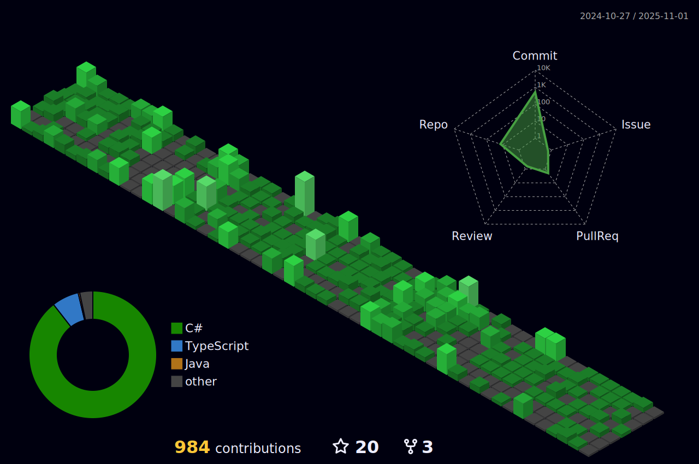

<h1 align="center">Olá 👋, Eu sou Murilo Nascimento</h1>
<h3 align="center">Desenvolvedor FullStack</h3>

<table align="right">
  <tr>
    <td height="43px">
      <b>
        <a href="README.md">Português 🇧🇷</a>
      </b>
    </td>
  </tr>
  <tr>
    <td height="43px">
      <a href="README-en.md">English 🇺🇸</a>
    </td>
  </tr>
</table>

  

- 🌐  Trabalhando com **React.js**, **TypeScript**, **PHP** e **SQL**

- 🌱 Atualmente estou aprendendo **Padrão de Arquitetura MVC com PHP**

- 🌇 Atualmente estou trabalhando na **[Teknisa](https://www.teknisa.com/)**

- 👨‍💻 Alguns dos meus principais projetos estão disponíveis em **[Meu Portfólio](https://my-portfolio-chi-nine.vercel.app/projects)**

  

## Atividades

## Linguagens e Ferramentas

  

## Conecte-se comigo

  

